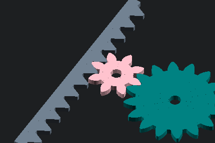

# scadbits

Highly optimized SCAD libraries.

## Libraries:

### `use <scadbits/gears.scad>`
A library for creating involute gears.

#### Modules:
* `sbGear(circularPitch=3, numberOfTeeth=12, holeRadius=undef, deleteTeeth=0, pressureAngle=28, clearance=0, backlash=0)`
  - A really fast involute gear generator with optional axle hole.
* `sbRack(linearPitch=3, numberOfTeeth=6, width=2, pressureAngle=28, backlash=0)`
  - A rack for use in a rack-and-pinion assembly.
* `sbGearDesigner(pitch=3, holeRadius=undef, redToothCount=8, greenToothCount=16, rackToothCount=12, rackWidth=2)`
  - Animated gear designer module. Generates a gear, rack, and pinion.

#### Functions:
* `sbGearRootRadius(circularPitch, numberOfTeeth)`
  - Calculate the root radius (lowest point of teeth) of a gear
* `sbGearOutsideRadius(circularPitch, numberOfTeeth, clearance=0)`
  - Calculate the outside radius (highest point of teeth) of a gear.
